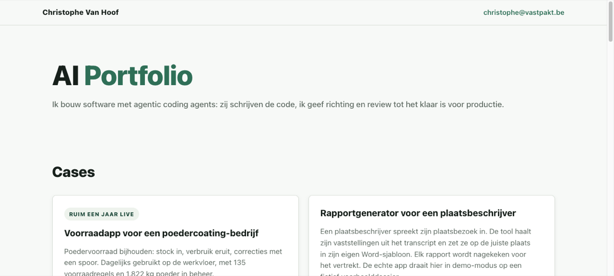

# vastpakt.be — portfolio

Personal site of **Christophe Van Hoof**, AI & software engineer.

**Live:** https://vastpakt.be

## What this is

Portfolio of software built with **agentic coding agents** (Claude Code, Codex): agents write the code; I set direction and review until it's ready for production.

## Start here

1. Open **[vastpakt.be](https://vastpakt.be)**  
2. Click a **live demo** on a case card  
3. For open source depth: **[blood-values-dashboard](https://github.com/ChristopheAI/blood-values-dashboard)** (Laravel) or **[proxmox-homelab](https://github.com/ChristopheAI/proxmox-homelab)** (ops docs)

## On the site

- How I work (agentic coding)
- Live cases with demo links (inventory, report generator, GTM/prospectie, villa, blood-values code)
- Background and contact

## Stack

Static HTML/CSS deployed on Vercel → `vastpakt.be`.

## Local

Open `index.html` in a browser, or serve the folder with any static server.

## Contact

- https://vastpakt.be  
- christophe@vastpakt.be  
- https://github.com/ChristopheAI  
